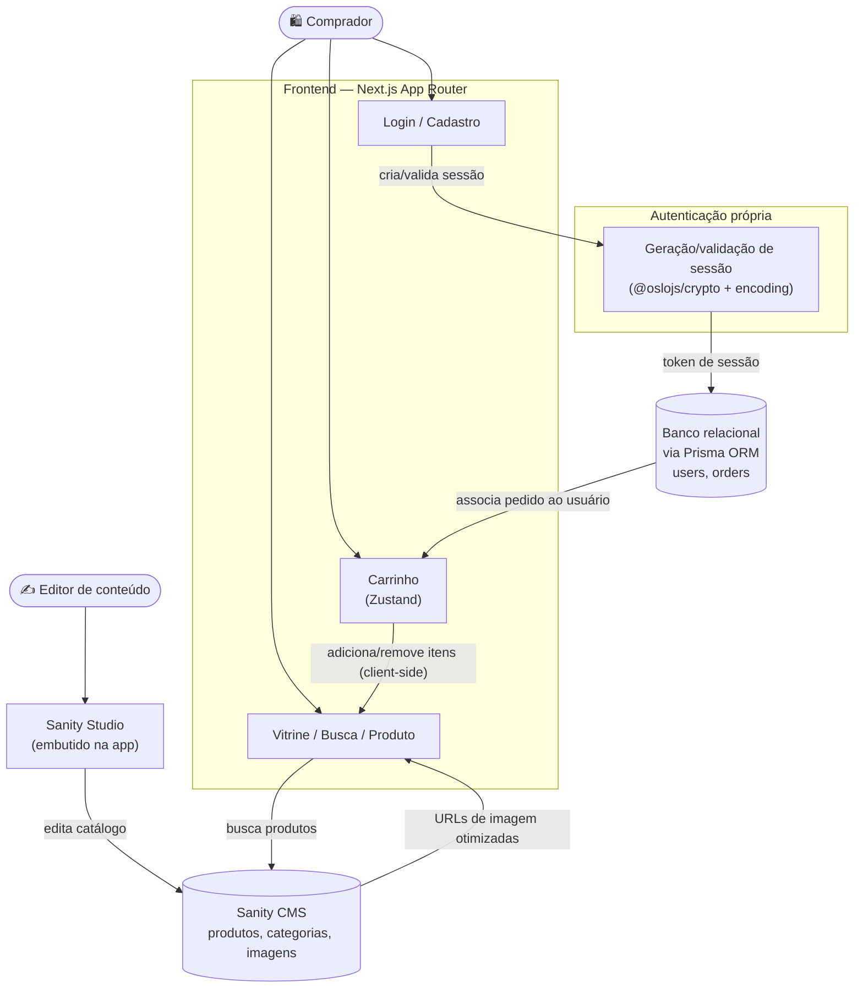

<div align="center">

# 🛍️ Marketto

### Marketplace de e-commerce — catálogo via CMS headless, carrinho e autenticação própria

[](https://nextjs.org)
[](https://react.dev)
[](https://www.typescriptlang.org)
[](https://www.sanity.io)
[](https://www.prisma.io)
[](https://zustand-demo.pmnd.rs)

</div>

---

## 📋 Sobre o projeto

**Marketto** é uma vitrine de e-commerce, no estilo **Temu**, construída com **Next.js 15**. O catálogo de produtos é gerenciado através de um **CMS headless (Sanity)** — o que permite editar produtos, categorias e conteúdo visual sem precisar mexer em código — enquanto dados transacionais (usuários, pedidos) ficam em um **banco relacional via Prisma**. A autenticação é implementada **do zero**, sem provedor terceirizado, usando primitivas de baixo nível de criptografia e sessão.

> 💡 Este README foi elaborado a partir do `package.json` real do repositório e da estrutura de pastas pública (`src/`, `prisma/`, `sanity.config.ts`, `.sanity/`). Ajuste os detalhes finos conforme a implementação exata do seu fork.

---

## ✨ Funcionalidades

| Funcionalidade | Descrição |
|---|---|
| 🗂️ **Catálogo de produtos** | Produtos, categorias e imagens gerenciados via **Sanity Studio** (CMS headless) |
| 🖼️ **Imagens otimizadas** | URLs de imagem geradas dinamicamente via `@sanity/image-url` (crop, tamanho, formato) |
| 🛒 **Carrinho de compras** | Estado do carrinho gerenciado no cliente com Zustand |
| 🔐 **Autenticação própria** | Sessões e criptografia implementadas com primitivas de baixo nível (`@oslojs/crypto`, `@oslojs/encoding`) — sem depender de um provedor terceirizado de auth |
| 📦 **Pedidos e usuários** | Dados transacionais persistidos em banco relacional via Prisma |
| 🎨 **Editor visual de conteúdo** | Painel do Sanity Studio embutido na própria aplicação Next.js |

---

## 🛠️ Tech Stack

| Camada | Tecnologia |
|---|---|
| **Framework** | Next.js 15 (App Router, Turbopack) |
| **UI** | Tailwind CSS 4, `styled-components`, `lucide-react` |
| **CMS de produtos** | Sanity (`sanity`, `next-sanity`, `@sanity/image-url`, `@sanity/vision`) |
| **Banco de dados / ORM** | Prisma ORM (usuários, pedidos) |
| **Autenticação** | Implementação própria com Oslo (`@oslojs/crypto`, `@oslojs/encoding`) — hashing e tokens de sessão manuais, no estilo Lucia Auth |
| **Estado do carrinho** | Zustand |
| **Validação** | Zod |
| **Linguagem** | TypeScript 5 |

---

## 🏗️ Arquitetura



### Como funciona o fluxo

1. Um **editor de conteúdo** gerencia o catálogo (produtos, categorias, imagens) através do **Sanity Studio**, embutido dentro da própria aplicação Next.js.
2. A **vitrine** consulta o **Sanity** (via GROQ/`next-sanity`) para exibir produtos, com imagens otimizadas geradas dinamicamente pelo `@sanity/image-url`.
3. O **carrinho de compras** é mantido inteiramente no cliente, via **Zustand**, para uma experiência instantânea sem round-trip ao servidor a cada alteração.
4. A **autenticação** é implementada manualmente: em vez de um provedor terceirizado, a aplicação gera e valida **tokens de sessão** e faz hashing de credenciais usando as primitivas de baixo nível do **Oslo** — um padrão popularizado pelo Lucia Auth.
5. Dados de **usuários e pedidos** (informação transacional, diferente do catálogo) são persistidos em um **banco relacional via Prisma**, mantendo a separação clara entre "conteúdo" (Sanity) e "dados de negócio" (Prisma).

> Ajuste os detalhes exatos do fluxo de checkout/pedido e do schema do Prisma conforme a implementação real em `src/`.

---

## 📁 Estrutura do projeto

```
nextjs-temu-clone/
├── .sanity/                 # Runtime/cache do Sanity Studio
├── prisma/                  # Schema do Prisma e migrations
├── public/                  # Assets estáticos
├── src/                     # Código-fonte (App Router, componentes, lib, auth)
├── sanity.config.ts         # Configuração do Sanity Studio
├── sanity.cli.ts            # CLI do Sanity
├── sanity.types.ts          # Tipos gerados a partir do schema do Sanity
├── schema.json               # Schema exportado do Sanity
├── middleware.ts             # Middleware de proteção de rotas
├── eslint.config.mjs
├── next.config.ts
├── postcss.config.mjs
├── tsconfig.json
├── package.json
└── README.md
```

---

## 📜 Scripts disponíveis

| Comando | Descrição |
|---|---|
| `npm run dev` | Inicia o servidor de desenvolvimento (Turbopack) |
| `npm run build` | Gera o build de produção |
| `npm run start` | Inicia o servidor em modo produção |
| `npm run lint` | Roda o ESLint no projeto |

---

## 🗺️ Roadmap

- [ ] Documentar o schema do Sanity (produtos, categorias) e do Prisma (usuários, pedidos)
- [ ] Detalhar o fluxo de checkout e cálculo de frete/pagamento
- [ ] Documentar o fluxo de autenticação própria (Oslo) — criação e expiração de sessão
- [ ] Adicionar testes automatizados
- [ ] Definir licença do projeto
